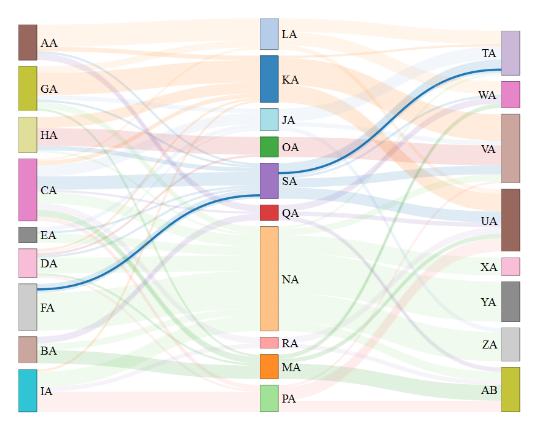

This README includes information on set up and a number of basic examples included in the modified tar.gz file.
For more information see the package's [main page](http://christophergandrud.github.io/networkD3/).

## Usage

Here's an example of `sankeyNetwork`:

```R
# Create fake data
structure(list(source = c(0, 18, 2, 18, 2, 9, 2, 10, 2, 18, 2, 
10, 2, 11, 2, 12, 4, 13, 3, 18, 3, 12, 3, 13, 3, 9, 3, 13, 3, 
13, 3, 10, 3, 13, 3, 14, 3, 13, 3, 13, 3, 15, 3, 13, 5, 13, 8, 
13, 8, 13, 2, 16, 5, 13, 5, 13, 5, 13, 5, 13, 8, 15, 8, 15, 6, 
10, 6, 11, 2, 17, 2, 17, 2, 13, 8, 13, 2, 12, 1, 12, 2, 9, 2, 
18, 2, 17, 2, 15, 8, 13, 8, 13, 4, 9, 5, 13, 2, 12, 8, 15, 2, 
15, 0, 10, 8, 15, 4, 13, 6, 10, 0, 11, 8, 15, 8, 17, 8, 17, 0, 
10, 0, 16, 0, 16, 1, 16, 0, 16, 1, 16, 2, 13, 6, 10, 6, 13, 6, 
11, 6, 11, 6, 10, 6, 10, 6, 10, 4, 18, 0, 11, 0, 11, 1, 16, 1, 
12, 5, 13, 2, 18, 2, 9, 6, 10, 6, 13, 7, 14, 7, 18, 7, 14, 7, 
10, 4, 13, 8, 15, 0, 11, 0, 11, 1, 13, 1, 13, 4, 9, 7, 14, 2, 
9, 1, 12, 0, 11, 8, 15, 5, 18, 8, 15, 7, 14, 7, 10, 7, 14, 7, 
10, 7, 10, 7, 10, 7, 18, 7, 14, 7, 13, 7, 14, 7, 14, 6, 10, 6, 
13, 4, 13, 6, 18, 6, 9, 6, 9, 6, 12, 5, 13, 5, 13, 5, 18, 5, 
18, 5, 13, 5, 13, 5, 13, 5, 13, 1, 12, 0, 11, 1, 12, 0, 11, 1, 
13, 1, 12, 2, 13, 5, 13, 8, 13, 8, 10, 8, 13, 2, 18, 8, 15, 0, 
11, 0, 11, 2, 13, 5, 18, 5, 13, 2, 9, 2, 18, 5, 13, 5, 13, 6, 
10, 6, 10, 2, 13), target = c(18, 19, 18, 19, 9, 19, 10, 20, 
18, 19, 10, 20, 11, 19, 12, 20, 13, 21, 18, 21, 12, 22, 13, 23, 
9, 19, 13, 24, 13, 24, 10, 21, 13, 25, 14, 21, 13, 24, 13, 23, 
15, 20, 13, 23, 13, 24, 13, 26, 13, 26, 16, 22, 13, 24, 13, 24, 
13, 24, 13, 24, 15, 20, 15, 20, 10, 20, 11, 19, 17, 20, 17, 20, 
13, 24, 13, 19, 12, 26, 12, 26, 9, 19, 18, 19, 17, 20, 15, 20, 
13, 21, 13, 25, 9, 25, 13, 24, 12, 26, 15, 26, 15, 20, 10, 20, 
15, 26, 13, 25, 10, 20, 11, 20, 15, 26, 17, 26, 17, 26, 10, 20, 
16, 20, 16, 20, 16, 26, 16, 22, 16, 26, 13, 26, 10, 21, 13, 24, 
11, 20, 11, 19, 10, 21, 10, 20, 10, 21, 18, 22, 11, 22, 11, 22, 
16, 22, 12, 20, 13, 25, 18, 20, 9, 19, 10, 19, 13, 24, 14, 21, 
18, 21, 14, 21, 10, 21, 13, 25, 15, 21, 11, 22, 11, 22, 13, 25, 
13, 26, 9, 19, 14, 21, 9, 25, 12, 26, 11, 19, 15, 26, 18, 20, 
15, 26, 14, 21, 10, 21, 14, 21, 10, 21, 10, 21, 10, 21, 18, 20, 
14, 21, 13, 24, 14, 21, 14, 21, 10, 21, 13, 21, 13, 25, 18, 21, 
9, 21, 9, 21, 12, 22, 13, 24, 13, 23, 18, 21, 18, 19, 13, 24, 
13, 23, 13, 23, 13, 23, 12, 26, 11, 22, 12, 26, 11, 22, 13, 25, 
12, 26, 13, 25, 13, 25, 13, 24, 10, 20, 13, 25, 18, 19, 15, 20, 
11, 19, 11, 19, 13, 25, 18, 20, 13, 24, 9, 19, 18, 20, 13, 24, 
13, 23, 10, 21, 10, 21, 13, 25), value = c(1, 1, 1, 1, 1, 1, 
1, 1, 1, 1, 1, 1, 1, 1, 1, 1, 1, 1, 1, 1, 1, 1, 1, 1, 1, 1, 1, 
1, 1, 1, 1, 1, 1, 1, 1, 1, 1, 1, 1, 1, 1, 1, 1, 1, 1, 1, 1, 1, 
1, 1, 1, 1, 1, 1, 1, 1, 1, 1, 1, 1, 1, 1, 1, 1, 1, 1, 1, 1, 1, 
1, 1, 1, 1, 1, 1, 1, 1, 1, 1, 1, 1, 1, 1, 1, 1, 1, 1, 1, 1, 1, 
1, 1, 1, 1, 1, 1, 1, 1, 1, 1, 1, 1, 1, 1, 1, 1, 1, 1, 1, 1, 1, 
1, 1, 1, 1, 1, 1, 1, 1, 1, 1, 1, 1, 1, 1, 1, 1, 1, 1, 1, 1, 1, 
1, 1, 1, 1, 1, 1, 1, 1, 1, 1, 1, 1, 1, 1, 1, 1, 1, 1, 1, 1, 1, 
1, 1, 1, 1, 1, 1, 1, 1, 1, 1, 1, 1, 1, 1, 1, 1, 1, 1, 1, 1, 1, 
1, 1, 1, 1, 1, 1, 1, 1, 1, 1, 1, 1, 1, 1, 1, 1, 1, 1, 1, 1, 1, 
1, 1, 1, 1, 1, 1, 1, 1, 1, 1, 1, 1, 1, 1, 1, 1, 1, 1, 1, 1, 1, 
1, 1, 1, 1, 1, 1, 1, 1, 1, 1, 1, 1, 1, 1, 1, 1, 1, 1, 1, 1, 1, 
1, 1, 1, 1, 1, 1, 1, 1, 1, 1, 1, 1, 1, 1, 1, 1, 1, 1, 1, 1, 1, 
1, 1, 1, 1, 1, 1, 1, 1, 1, 1, 1, 1, 1, 1, 1, 1, 1, 1, 1, 1, 1, 
1, 1, 1, 1, 1, 1, 1, 1, 1, 1, 1, 1, 1, 1, 1, 1, 1, 1, 1, 1, 1, 
1, 1, 1, 1), LinkName = c("AA", "AA", "AB", "AB", "AC", "AC", 
"AD", "AD", "AE", "AE", "AF", "AF", "BA", "BA", "BB", "BB", "BC", 
"BC", "BD", "BD", "BE", "BE", "BF", "BF", "CA", "CA", "CB", "CB", 
"CC", "CC", "CD", "CD", "CE", "CE", "CF", "CF", "DA", "DA", "DB", 
"DB", "DC", "DC", "DD", "DD", "DE", "DE", "DF", "DF", "EA", "EA", 
"EB", "EB", "EC", "EC", "ED", "ED", "EE", "EE", "EF", "EF", "FA", 
"FA", "FB", "FB", "FC", "FC", "FD", "FD", "FE", "FE", "FF", "FF", 
"GA", "GA", "GB", "GB", "GC", "GC", "GD", "GD", "GE", "GE", "GF", 
"GF", "HA", "HA", "HB", "HB", "HC", "HC", "HD", "HD", "HE", "HE", 
"HF", "HF", "IA", "IA", "IB", "IB", "IC", "IC", "ID", "ID", "IE", 
"IE", "IF", "IF", "JA", "JA", "JB", "JB", "JC", "JC", "JD", "JD", 
"JE", "JE", "JF", "JF", "KA", "KA", "KB", "KB", "KC", "KC", "KD", 
"KD", "KE", "KE", "KF", "KF", "LA", "LA", "LB", "LB", "LC", "LC", 
"LD", "LD", "LE", "LE", "LF", "LF", "MA", "MA", "MB", "MB", "MC", 
"MC", "MD", "MD", "ME", "ME", "MF", "MF", "NA", "NA", "NB", "NB", 
"NC", "NC", "ND", "ND", "NE", "NE", "NF", "NF", "OA", "OA", "OB", 
"OB", "OC", "OC", "OD", "OD", "OE", "OE", "OF", "OF", "PA", "PA", 
"PB", "PB", "PC", "PC", "PD", "PD", "PE", "PE", "PF", "PF", "QA", 
"QA", "QB", "QB", "QC", "QC", "QD", "QD", "QE", "QE", "QF", "QF", 
"RA", "RA", "RB", "RB", "RC", "RC", "RD", "RD", "RE", "RE", "RF", 
"RF", "SA", "SA", "SB", "SB", "SC", "SC", "SD", "SD", "SE", "SE", 
"SF", "SF", "TA", "TA", "TB", "TB", "TC", "TC", "TD", "TD", "TE", 
"TE", "TF", "TF", "UA", "UA", "UB", "UB", "UC", "UC", "UD", "UD", 
"UE", "UE", "UF", "UF", "VA", "VA", "VB", "VB", "VC", "VC", "VD", 
"VD", "VE", "VE", "VF", "VF", "WA", "WA", "WB", "WB", "WC", "WC", 
"WD", "WD", "WE", "WE", "XA", "XA", "XB", "XB", "XC", "XC", "XD", 
"XD", "XE", "XE", "YA", "YA", "YB", "YB", "YC", "YC", "YD", "YD", 
"YE", "YE", "ZA", "ZA", "ZB", "ZB", "ZC", "ZC", "ZD", "ZD", "ZE", 
"ZE"), LinkGroup = c("10", "10", "10", "10", "1", "1", "2", "2", 
"10", "10", "2", "2", "3", "3", "4", "4", "5", "5", "10", "10", 
"4", "4", "5", "5", "1", "1", "5", "5", "5", "5", "2", "2", "5", 
"5", "6", "6", "5", "5", "5", "5", "7", "7", "5", "5", "5", "5", 
"5", "5", "5", "5", "8", "8", "5", "5", "5", "5", "5", "5", "5", 
"5", "7", "7", "7", "7", "2", "2", "3", "3", "9", "9", "9", "9", 
"5", "5", "5", "5", "4", "4", "4", "4", "1", "1", "10", "10", 
"9", "9", "7", "7", "5", "5", "5", "5", "1", "1", "5", "5", "4", 
"4", "7", "7", "7", "7", "2", "2", "7", "7", "5", "5", "2", "2", 
"3", "3", "7", "7", "9", "9", "9", "9", "2", "2", "8", "8", "8", 
"8", "8", "8", "8", "8", "8", "8", "5", "5", "2", "2", "5", "5", 
"3", "3", "3", "3", "2", "2", "2", "2", "2", "2", "10", "10", 
"3", "3", "3", "3", "8", "8", "4", "4", "5", "5", "10", "10", 
"1", "1", "2", "2", "5", "5", "6", "6", "10", "10", "6", "6", 
"2", "2", "5", "5", "7", "7", "3", "3", "3", "3", "5", "5", "5", 
"5", "1", "1", "6", "6", "1", "1", "4", "4", "3", "3", "7", "7", 
"10", "10", "7", "7", "6", "6", "2", "2", "6", "6", "2", "2", 
"2", "2", "2", "2", "10", "10", "6", "6", "5", "5", "6", "6", 
"6", "6", "2", "2", "5", "5", "5", "5", "10", "10", "1", "1", 
"1", "1", "4", "4", "5", "5", "5", "5", "10", "10", "10", "10", 
"5", "5", "5", "5", "5", "5", "5", "5", "4", "4", "3", "3", "4", 
"4", "3", "3", "5", "5", "4", "4", "5", "5", "5", "5", "5", "5", 
"2", "2", "5", "5", "10", "10", "7", "7", "3", "3", "3", "3", 
"5", "5", "10", "10", "5", "5", "1", "1", "10", "10", "5", "5", 
"5", "5", "2", "2", "2", "2", "5", "5")), .Names = c("source", 
"target", "value", "LinkName", "LinkGroup"), row.names = c(149L, 
301L, 146L, 298L, 152L, 304L, 90L, 242L, 132L, 284L, 84L, 236L, 
41L, 193L, 98L, 250L, 63L, 215L, 15L, 167L, 117L, 269L, 14L, 
166L, 93L, 245L, 75L, 227L, 20L, 172L, 12L, 164L, 96L, 248L, 
27L, 179L, 34L, 186L, 1L, 153L, 51L, 203L, 4L, 156L, 6L, 158L, 
92L, 244L, 87L, 239L, 116L, 268L, 17L, 169L, 7L, 159L, 8L, 160L, 
29L, 181L, 43L, 195L, 57L, 209L, 145L, 297L, 105L, 257L, 130L, 
282L, 147L, 299L, 137L, 289L, 91L, 243L, 100L, 252L, 59L, 211L, 
44L, 196L, 134L, 286L, 148L, 300L, 136L, 288L, 151L, 303L, 83L, 
235L, 113L, 265L, 36L, 188L, 123L, 275L, 32L, 184L, 101L, 253L, 
55L, 207L, 50L, 202L, 143L, 295L, 65L, 217L, 56L, 208L, 38L, 
190L, 25L, 177L, 53L, 205L, 60L, 212L, 142L, 294L, 104L, 256L, 
135L, 287L, 150L, 302L, 109L, 261L, 64L, 216L, 61L, 213L, 80L, 
232L, 82L, 234L, 95L, 247L, 140L, 292L, 120L, 272L, 46L, 198L, 
126L, 278L, 128L, 280L, 124L, 276L, 131L, 283L, 86L, 238L, 99L, 
251L, 144L, 296L, 138L, 290L, 139L, 291L, 37L, 189L, 31L, 183L, 
42L, 194L, 22L, 174L, 16L, 168L, 76L, 228L, 97L, 249L, 110L, 
262L, 112L, 264L, 66L, 218L, 111L, 263L, 102L, 254L, 68L, 220L, 
54L, 206L, 106L, 258L, 35L, 187L, 67L, 219L, 58L, 210L, 62L, 
214L, 26L, 178L, 11L, 163L, 24L, 176L, 18L, 170L, 47L, 199L, 
45L, 197L, 39L, 191L, 69L, 221L, 19L, 171L, 30L, 182L, 23L, 175L, 
52L, 204L, 48L, 200L, 74L, 226L, 114L, 266L, 103L, 255L, 118L, 
270L, 141L, 293L, 21L, 173L, 10L, 162L, 129L, 281L, 125L, 277L, 
9L, 161L, 3L, 155L, 5L, 157L, 2L, 154L, 78L, 230L, 79L, 231L, 
72L, 224L, 108L, 260L, 70L, 222L, 89L, 241L, 40L, 192L, 119L, 
271L, 127L, 279L, 77L, 229L, 85L, 237L, 107L, 259L, 73L, 225L, 
121L, 273L, 71L, 223L, 94L, 246L, 81L, 233L, 49L, 201L, 33L, 
185L, 133L, 285L, 28L, 180L, 13L, 165L, 115L, 267L, 88L, 240L, 
122L, 274L), class = "data.frame")
```

```R
# Plot
sankeyNetwork(
  Links = data,
  Nodes = my_nodes,
  Source = "source",
  Target = "target",
  NodeID = "name",
  LinkGroup = "LinkGroup",
  LinkName = "LinkName",
  linkOpacity = .15,
  highlightOpacity = 1,
  Value = 3,
  fontSize = 20,
  nodeWidth = 30
  )
```

